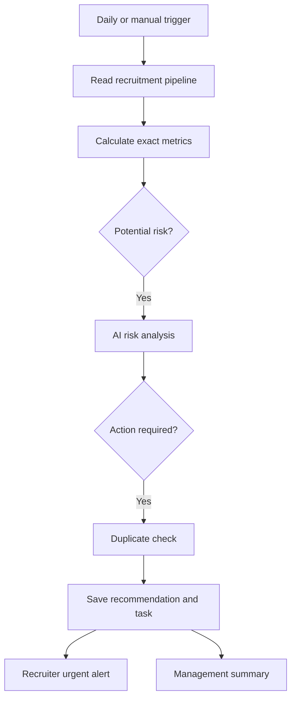

# RecruitmentOS AI — Revenue Recovery Agent

An AI-assisted operations system for recruitment and staffing agencies. It monitors active candidate applications, detects placement risks, estimates revenue exposure, creates recovery tasks, and alerts the appropriate team before opportunities are lost.

> This repository contains a sanitized portfolio implementation built with n8n, Supabase, OpenAI, and Telegram. All included names and records are synthetic.

## Business problem

Recruitment agencies can lose placement fees when client feedback is delayed, candidate follow-ups are missed, interview reminders are not sent, or recruiter tasks become overdue. These risks are often spread across an applicant-tracking system and may not become visible until the placement is already in danger.

RecruitmentOS reviews the pipeline every morning and converts those warning signs into prioritized recovery actions.

## What the system does

- Retrieves related clients, vacancies, candidates, applications, interviews, tasks, and activity records from Supabase.
- Calculates deterministic metrics such as inactivity, overdue tasks, upcoming interviews, and estimated placement value.
- Filters normal applications before invoking the AI model.
- Uses an AI agent to classify the risk, explain the evidence, assign priority, and recommend one human action.
- Prevents duplicate pending recommendations for the same application and risk type.
- Saves an auditable AI recommendation and creates a linked recovery task.
- Sends individual high-priority alerts to the responsible recruitment team.
- Sends a combined revenue-recovery summary to management.

## Architecture



Code handles dates, counts, and revenue calculations. The AI is limited to contextual judgment and recommendation generation; it does not contact candidates or clients autonomously.

## Technology

- **n8n:** workflow orchestration
- **Supabase/PostgreSQL:** operational database and REST API
- **OpenAI:** contextual risk analysis with structured output
- **Telegram:** urgent and management notifications
- **JavaScript:** deterministic metrics and summary generation

## Repository structure

```text
.
├── database/
│   ├── demo_data.sql
│   └── schema.sql
├── docs/
│   ├── architecture.md
│   ├── portfolio-copy.md
│   └── images/
│       └── workflow-overview.png
├── workflow/
│   └── recruitmentos-revenue-recovery-agent.json
├── .env.example
├── LICENSE
└── README.md
```

## Setup

1. Create a Supabase project.
2. Run `database/schema.sql` in the Supabase SQL editor.
3. Optionally run `database/demo_data.sql` to add synthetic demonstration records.
4. Import `workflow/recruitmentos-revenue-recovery-agent.json` into n8n.
5. Replace every `YOUR_PROJECT_REF` placeholder with your Supabase project reference.
6. Create and select the required Supabase, OpenAI, and Telegram credentials in n8n.
7. Replace the two Telegram Chat ID placeholders. In production, use a recruiter destination for urgent alerts and a management destination for the combined summary.
8. Update the task assignee and workflow timezone for the client.
9. Test with the Manual Trigger, confirm the database writes, and then activate the schedule.

Never commit API keys, service-role keys, bot tokens, real candidate information, or exported n8n credential identifiers.

## Demonstration scenario

The included data creates three synthetic pipeline risks:

1. An overdue client-feedback task after an interview.
2. A candidate application with several days of inactivity.
3. An interview happening within 48 hours without a recorded reminder.

Run the workflow manually and inspect:

- `ai_recommendations` for the AI decision and evidence.
- `tasks` for the generated recovery action.
- Telegram for individual urgent alerts and the combined management summary.

Run it again without resolving the recommendations. The duplicate check should prevent a second pending recommendation for the same application and risk type.

## Safety and production considerations

- Keep final contact with clients and candidates human-approved.
- Use the Supabase service-role credential only inside the secured n8n credential store.
- Apply least-privilege database access in a production deployment.
- Add an error workflow and operational monitoring before processing live data.
- Review retention, privacy, and AI-use requirements for the agency's jurisdiction.
- Treat estimated revenue as a prioritization signal, not recognized accounting revenue.

## Portfolio outcome

This project demonstrates API integration, relational data modeling, structured AI output, deterministic calculations, risk classification, duplicate protection, database writes, task generation, branching notifications, and management reporting.

## Author

Joshua — AI automation systems for revenue operations and business workflows.

