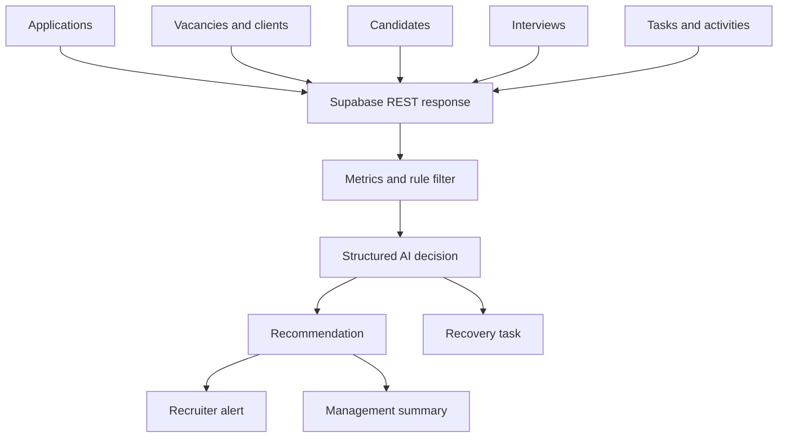

# System architecture

## Decision pipeline

| Layer | Responsibility | Why it exists |
| --- | --- | --- |
| Trigger | Start manually or every morning | Supports demonstrations and unattended operation |
| Data access | Read the relational recruitment pipeline through Supabase REST | Gives the agent the full application context |
| Deterministic analysis | Calculate inactivity, task deadlines, interview proximity, reminders, and revenue | Keeps factual calculations out of the language model |
| Rule filter | Pass only plausible risks | Reduces model cost and unnecessary analysis |
| AI analysis | Classify contextual risk and recommend one action | Handles judgment across several related records |
| Guardrail | Require action and suppress duplicate pending recommendations | Prevents noise and repeated work |
| Execution | Save an auditable recommendation and create a recovery task | Converts analysis into accountable work |
| Notification | Route urgent cases to recruiters and a combined summary to management | Separates operational action from oversight |

## Data flow

## AI boundaries

The agent may interpret evidence and propose the next action. It may not invent events or financial values, contact a person, or claim that work has been completed. IDs, financial exposure, timestamps, task counts, and interview proximity originate from database records and code.

## Duplicate protection

Before inserting a recommendation, the workflow searches for a record with the same `application_id`, `recommendation_type`, and `pending` status. An unresolved recommendation suppresses another copy. A client deployment should define how a recommendation becomes resolved, dismissed, or superseded.

## Notification routing

The two Telegram nodes intentionally serve different roles:

- Individual urgent alerts belong in the responsible recruiter or account-manager channel.
- The aggregated daily summary belongs in a management or operations channel.

They may use the same personal Chat ID during a demonstration, but production destinations should be separated.

